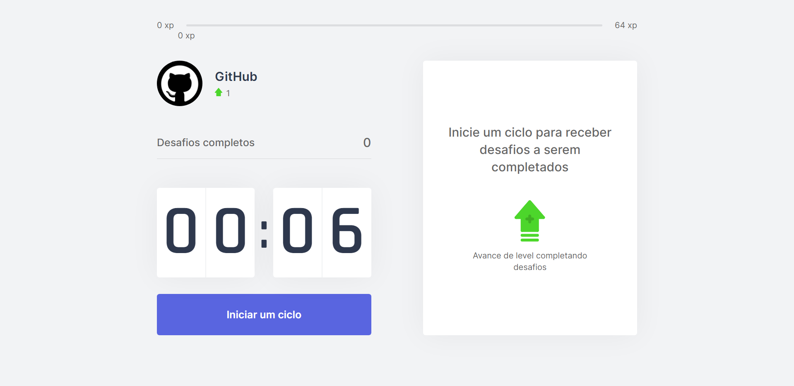
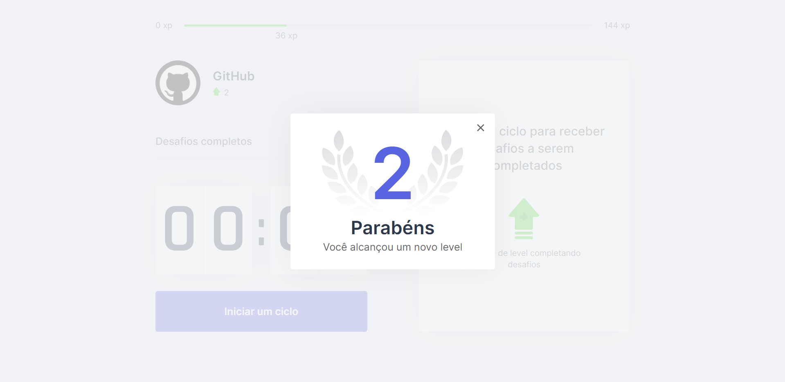

<h4 align="center">
    <h1 align="center">
      
    </h1>
    <br><br>
    <p align="center">
      <a href="#-about">About</a>&nbsp;&nbsp;&nbsp;|&nbsp;&nbsp;&nbsp;
      <a href="#-technologies">Technologies</a>&nbsp;&nbsp;&nbsp;|&nbsp;&nbsp;&nbsp;
      <a href="#-how-to-run-the-project">Run</a>&nbsp;&nbsp;&nbsp;|&nbsp;&nbsp;&nbsp;
      <a href="#-info">Info</a>&nbsp;&nbsp;&nbsp;|&nbsp;&nbsp;&nbsp;
      <a href="#-changelog">Changelog</a>&nbsp;&nbsp;&nbsp;|&nbsp;&nbsp;&nbsp;
      <a href="#-license">License</a>
  </p>
</h4>

<h1 align="center">
  
  <div style="display: flex; flex-direction: row;">
    
    
  <div>
</h1>

## 🔖 About
O Move.it é uma aplicação gamificada de gerenciamento que utiliza um cronômetro e a conquista de xp para incentivar a divisão de um trabalho em períodos, com pausas, conforme a técnica de pomodoro.

## 🚀 Technologies
- [REACT](https://reactjs.org/)
- [YARN](https://yarnpkg.com/)
- [Typescript](https://www.typescriptlang.org/)

## 🏁 How to run the project
#### Clone the repository
```bash
git clone https://github.com/rafinhaa/projeto-moveit-next.git
cd projeto-moveit-next
```

####Install dependencies
```bash
yarn install
```

#### Run the application
```bash
yarn dev
```

## ℹ️ Info
- [Ambiente](https://www.notion.so/Configura-es-do-ambiente-React-76f2963a042f45b9b9b567a2795945b8)
- [Version 2.0](https://www.figma.com/file/QCNZO6CKnlJP7ASSNp67f8/Move.it-2.0-(Copy)?node-id=149854%3A100)

## 📄 Changelog
##### v0.0.5b
- Storage by cookies
- Modal levelUp

##### v0.0.4b
- Estrutura leveling
- Notificação web
- Audio web

##### v0.0.3b
- Finalizado Contdown
- Componente ChallengeBox
- Contexto
- Regras de negócio

##### v0.0.2b
- Migrado para next.js
- Single Page Aplication
- Server Side Render
- Static Side Generation
- Componente perfil
- Componente CompletedChallenges
- Componente Contdown
- Hook countdown 

##### v0.0.1b
- Criação do componente ExperienceBar

## 📝 License

[MIT](LICENSE.txt)

**Free Software, Hell Yeah!**